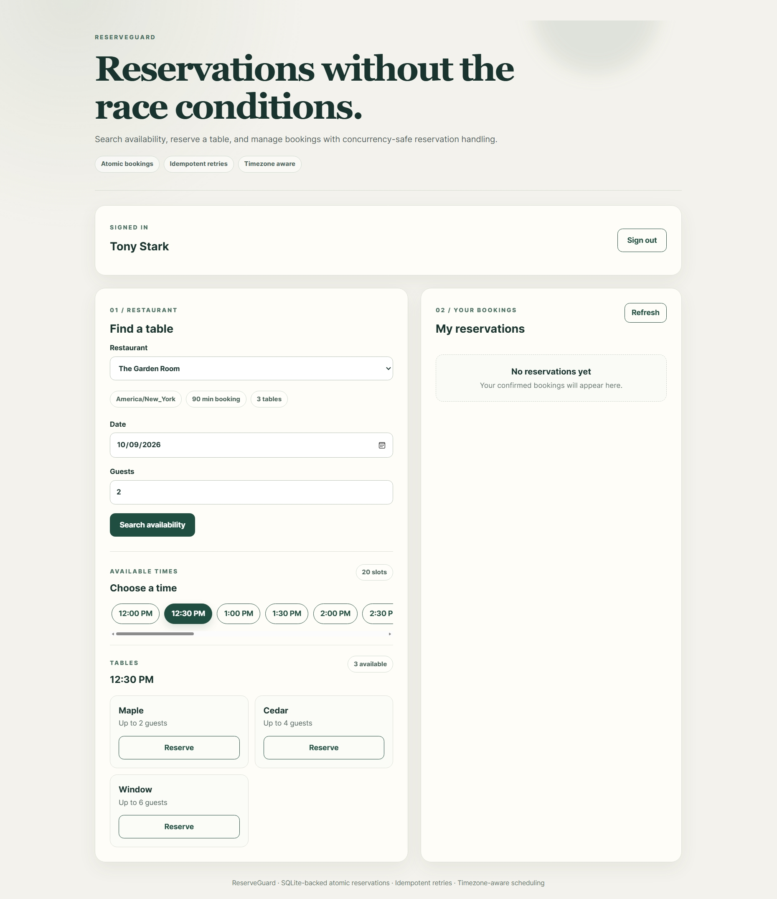
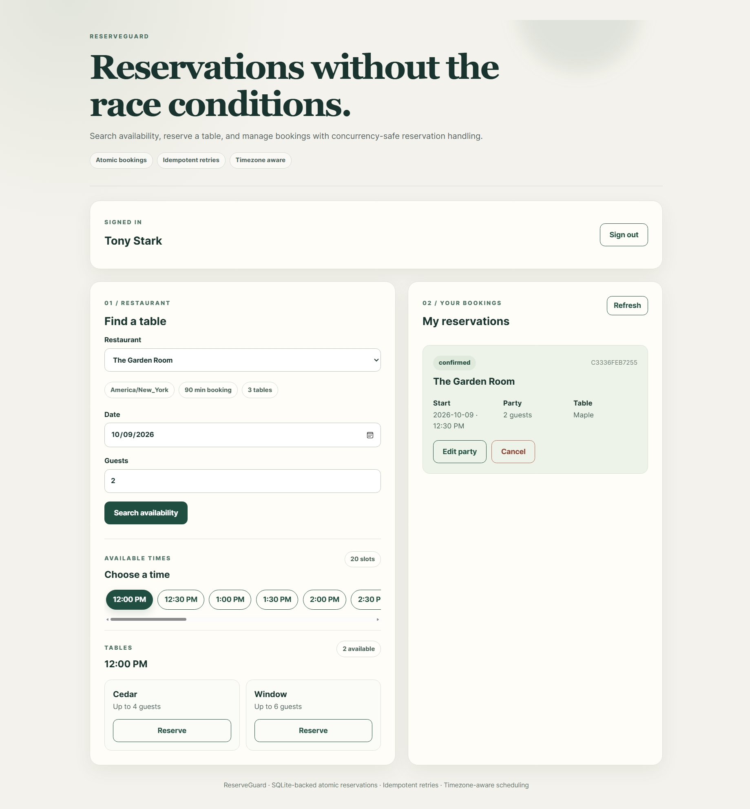

# ReserveGuard

A concurrency-safe restaurant reservation system demonstrating reliable booking behavior under simultaneous requests, retries, time-zone differences, and reservation updates.

## Screenshots

### Availability Search



### Confirmed Reservation




## Overview

ReserveGuard is a full-stack portfolio project with a React frontend, a Python HTTP backend, and SQLite storage. It focuses on preventing double bookings and handling reservation operations reliably.

The application is designed to run locally. No hosted backend or external database is required.

## Features

- Multiple restaurants with different time zones and booking durations
- Account signup and login
- Availability search by date and party size
- Atomic reservation creation
- Protection against overlapping bookings
- Idempotent booking requests
- Reservation editing and cancellation
- Timezone-aware scheduling
- Responsive React interface
- SQLite-backed persistence
- Dockerized backend
- Automated backend tests

## Tech Stack

**Frontend:** React, TypeScript, Vite, CSS

**Backend:** Python 3.11, `ThreadingHTTPServer`, SQLite, `zoneinfo`

**Infrastructure:** Docker

## Project Structure

```text
ReserveGuard/
├── backend/s
│   ├── Dockerfile
│   ├── .dockerignore
│   └── service.py
├── frontend/
│   ├── src/
│   ├── package.json
│   ├── vite.config.ts
│   ├── vercel.json
│   └── index.html
├── tests/
│   └── test_backend.py
├── .gitignore
└── README.md
```

## Running Locally

Requirements: Python 3.11+, Node.js and npm.

**1. Start the backend**

From the repository root:

```powershell
$env:PORTFOLIO_DEMO="1"
$env:PORT="8090"
$env:DATABASE_PATH="./reserveguard-demo.sqlite"
python .\backend\service.py
```

The backend runs at `http://127.0.0.1:8090`.

**2. Start the frontend**

Open another terminal:

```powershell
cd frontend
npm ci
npm run dev
```

Open `http://127.0.0.1:5173` in your browser.

The Vite development server proxies `/api` requests to the local backend.

## Running Backend Tests

From the repository root:

```powershell
python -m pytest .\tests\test_backend.py -q
```

The backend test suite covers reservation behavior, including concurrency and idempotency.

## Docker

Build the backend image from the repository root:

```powershell
docker build -t reserveguard-backend .\backend
```

Run the container:

```powershell
docker run --rm -p 8090:8080 reserveguard-backend
```

Check `http://127.0.0.1:8090/health`.

## Reliability Design

ReserveGuard uses SQLite transactions and database constraints to protect reservation state when requests arrive concurrently. Idempotency keys make booking retries safe, and IANA time-zone data supports restaurant-specific scheduling.

## Portfolio Note

This repository is presented as a locally runnable engineering demonstration. Screenshots and automated tests provide evidence of the application behavior without requiring continuous cloud hosting.
